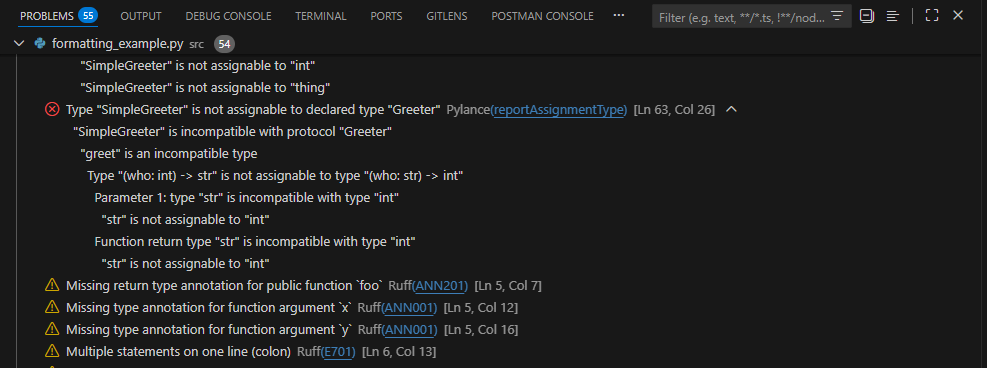

# GOSH Code Formatting Configuration

This repository contains VS Code configuration files and tooling standards for the GOSH Bioinformatics team. The primary goals are:

- **Standardise** formatting and tooling across all team members
- **Streamline** onboarding of new team members
- **Reduce** setup time for new Python projects

## Features, Team Standards & PEP8 Deviations

- **Fast Tooling**: Ruff for linting, formatting, and import sorting
- **Type Checking**: Pylance/Pyright integration with configurable strictness levels

The following standards were agreed as 'in-house' conventions after consultation with team members:

- **Line length**: Maximum 120 characters (vs PEP8's 79)
- **Docstring style**: Google format (vs PEP257's reStructuredText)
- **Type hints**: Gradual adoption encouraged, especially for public APIs
- **Import organization**: Alphabetical sorting with Ruff (vs PEP8's group imports by type: stdlib, third-party, local)

## Getting Started

The formatting, linting, and type checking configuration can be found in `pyproject.toml`.  Linting & formatting is handled by `ruff`, a super fast linter/formatter implemented in Rust.  Type checking is via `pyright` which is implemented in `pylance`.

### Configuration for New Projects: Use as a project template

<span style="color:red">WARNING:</span> The default is for  `FormatOnSave`.

```bash
# Clone this repository as your starting point
git clone https://github.com/gosh-team/code-formatting.git your-new-project
cd your-new-project

# Create & source a venv - `ruff` expects this to be named `.venv`, adjust the `pyproject.toml` accordingly if this is not the case.
python3 -m venv .venv
source .venv/bin/activate

# Update project specific details as appropriate
PROJECT_NAME="your-project-name"
MAINTAINER_NAME="your-name"
MAINTAINER_EMAIL="your_email@gosh.nhs.uk"
sed -i "s/project-template/$PROJECT_NAME/g" pyproject.toml
sed -i "s/your-name/$MAINTAINER_NAME/g" pyproject.toml
sed -i "s/your-email@gosh.nhs.uk/$MAINTAINER_EMAIL/g" pyproject.toml

# Alternatively search for UPDATE in `pyproject.toml` to identify lines that may need manually amending
# NOTE: Currently the formatting/linting is targeted at python 3.10 - update this manually as required as per above instructions.
```

The file `src/formatting_example.py` can be used to check the formatting is working, it contains a number of errors which should be highlighted by the linter/type checker.  It is easy to unintentionally overwrite this file when `FormatOnSave` is on - it can be refreshed by copying & pasting form `examples/badly_fortmatted_code.txt`.

### Configuration for Legacy Projects: Copy configuration to your existing project

<span style="color:red">WARNING:</span> The default is for  `FormatOnSave`, this may be inappropriate for legacy codebases which require a more granular approach to formmating.  Adjust the `.vscode/settings.json` as appropriate.

Copy these folders/files from this repository to your project editing as required:

- **`.vscode/`**
- **`pyproject.toml`**
- **`.editorconfig`**
- **`.gitignore`**

The `pyproject.toml` file will need editing manually, for the most park relevant lines are labelled with `# UPDATE:` end-of-line comments.  Specific areas which may need updating for legacy codebases are:

- **Project Details:** Update project name, maintainer name, and maintainer email.
- **Targeted Python version:** Set to 3.10 as default, change as appropriate
- **Folder containing code:** Set to `src` by default, change as appropriate

## Using the Tools in VS Code

### Essential VS Code Extensions (Auto-recommended)

When you open a project with these configs, VS Code will suggest installing:

- **Python** (`ms-python.python`) – Core Python support
- **Ruff** (`charliermarsh.ruff`) – Fast linting and formatting
- **Pylance** (`ms-python.vscode-pylance`) – Advanced Python language features
- **MyPy** (`ms-python.mypy-type-checker`) – Type checking integration

### Automatic Formatting

- **Format on Save**: Enabled automatically – your code formats when you save
- **Format Document**: `Shift+Alt+F` or right-click → **Format Document**
- **Format Selection**: Select code and use `Ctrl+K Ctrl+F`

### Code Quality Integration

- **Problems Panel**: `Ctrl+Shift+M` shows linting <span style="color:red">errors</span> and <span style="color:#E3BA11">warnings</span> in the Problems Tab.  The example below lists 55 problems - these can be filtered using the filter in the top right.  Filtering by `pylance` will show type checking problems, `ruff` will show python linting issues, and `prettier` and `markdownlint` will show linking for their respective files.



- **Quick Fixes**: `Ctrl+.` on underlined code for automatic fixes (Requires Github Co-pilot)
- **Organize Imports**: `Shift+Alt+O` sorts and removes unused imports
- **Type Checking**: Inline type errors shown as red squiggles

### Command Palette Quick Actions

Press `Ctrl+Shift+P` and type:

- **"Python: Select Interpreter"** – Choose your virtual environment
- **"Ruff: Format Document"** – Manual formatting
- **"Python: Run Tests"** – Execute pytest
- **"Organize Imports"** - Organize Imports

## Customisation

Teams may extend Ruff/Pyright rules locally, but core conventions (line length, docstrings, imports) should remain aligned with this template to maximise consistency across the GOSH Bioinformatics codebase.

If you believe the default strictness need adjusting please raise an issue on this repo to leave feedback.

### Configuring Ruff Linting Stictness

Linnting is configured via the `[tool.ruff]` section in `pyproject.toml`.  Note taht as `ruff` handles linting and formmating there are two subsections  `[tool.ruff.lint]` and `[tool.ruff.format]`.

The default setup includes options that capture both *bugs/security issues* and *purely stylistic issues*.  The core set of linting/formatting options is included below, if the linting feedback is *too noisy* it is safe to exclude any options commented out below and still have solid linting.  Any checks in future CI/CD integration is likely to use this subset.

```toml
select = [
    "E",      # pycodestyle errors
    "F",      # pyflakes
    "I",      # isort
    "UP",     # pyupgrade
    "B",      # flake8-bugbear  (Noisy)
    # "C4",     # flake8-comprehensions
    # "T20",    # flake8-print (no print statements) (Noisy)
    # "SIM",    # flake8-simplify
    # "N",      # pep8-naming
    # "Q",      # flake8-quotes
    "RUF",    # Ruff-specific rules
    "ASYNC",  # flake8-async
    "S",      # flake8-bandit (security)
    # "PTH",    # flake8-use-pathlib
    # "ERA",    # eradicate (commented-out code)
    # "PL",     # pylint (Noisy)
    # "PERF",   # perflint (performance)
    # "ANN",    # flake8-annotations  (Noisy)
    "ARG",    # flake8-unused-arguments
    "RET",    # flake8-return
    # "TCH",    # flake8-type-checking
]
```

### Configuring Pyright Typing Strictness

Pyright is configured via the `[tool.pyright]` section in `pyproject.toml`.

- **Default**: `typeCheckingMode = "basic"` with a moderate set of diagnostics enabled.
- **Stricter typing** (per-project or per-repo):

  1. Change in `pyproject.toml`:

     ```toml
     [tool.pyright]
     typeCheckingMode = "strict"
     ```

  2. Optionally uncomment/enable additional `report*` rules in the same section for even tighter checks (e.g. `reportMissingTypeStubs`, `reportUnused*`, `reportImplicitOverride`, etc.).

## Command Line Usage

From the project root (with `pyproject.toml`):

- **Format & lint & type-check** (recommended):

  ```bash
  ruff format . && ruff check . --fix && pyright
  ```

- **Lint & type-check only**:

  ```bash
  ruff check . && pyright
  ```

- **Lint only**:

  ```bash
  ruff check . --fix
  ```

## Notes

### Excluding sections from formatting

If you need to keep a small section of code exactly as written (e.g. alignment-sensitive output or embedded templates), you can disable the formatter with pragmas: add `# fmt: off` before the block and `# fmt: on` after it.


### Notes on Import sorting

The formatter will not move deliberately placed mid-file imports to the top of the file. Ruff can normalise and sort existing import blocks, but it respects execution order and will not reorder statements in a way that changes runtime behaviour.

### Formatter safety

The Ruff formatter is AST-safe: it does not change the underlying abstract syntax tree of your code. Formatting only affects presentation (whitespace, line breaks, quote style), not semantics, so running the code before and after formatting will produce the same results.
